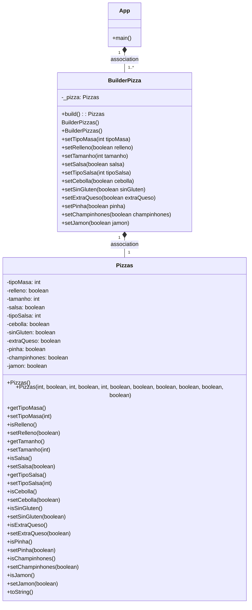

### FUNCIÓN PATRÓN  BUILDER
El patrón Builder sirve para crear un objeto sin constructores con la ayuda de una
clase auxiliar, es decir, simplifica el proceso de construcción de un objeto, permitiéndonos
tener un mayor control en el proceso de creación
de un objeto.

#### RELACIÓN CON PATRÓN FACTORY
Ambos son patrones creacionales dedicados a la creación
de instancias.  Por un lado, el Factory no requiere la
creación de una instancia y se puede compartir entre los
objetos que la necesitan, mientras que en el patrón
Builder, es necesario crear una instancia de Builder. 
Así también, el Builder requiere la llamada de 
varios métodos junto con el método final *build()*. En tanto, el Factory crea la instancia en un solo paso. 
Juntando ambos patrones, el Factory nos devolvería 
un Builder de la clase, para posteriormente,
usar el Builder con el fin de construir el número
de objetos que queramos con los atributos deseados.

#### DIAGRAMA

