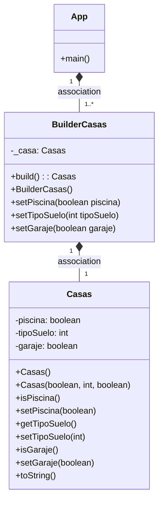
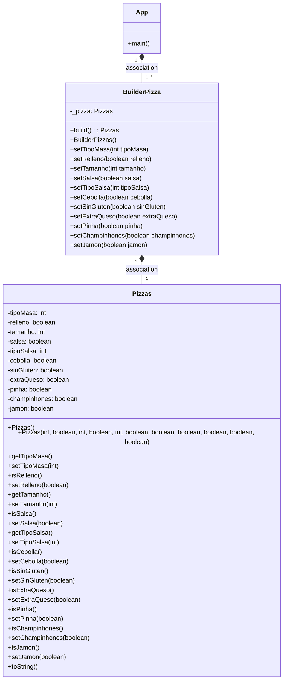

### FUNCIÓN PATRÓN  BUILDER
El patrón Builder sirve para crear un objeto sin constructores con la ayuda de una
clase auxiliar, es decir, simplifica el proceso de construcción de un objeto, permitiéndonos
tener un mayor control en el proceso de creación
de un objeto.

#### BUILDER CASA

***Clase Casas***

En la clase Casas declaro los atributos que tendrán las diferentes
casas que creemos y también los constructores juntos con los setters y getters
<br>Por un lado estará el constructor por defecto,
para que la casa tenga ya unas características
predeterminadas:

```
 public Casas() {
        this.tipoSuelo = MADERA;
        this.piscina = false;

    }   
```   
Y también el parametrizado, que usaremos
para añadir las características que queramos:
```
 public Casas(boolean piscina, int tipoSuelo, boolean garaje) {
        this.piscina = piscina;
        this.tipoSuelo = tipoSuelo;
        this.garaje = garaje;

    }  
```  

***Clase BuilderCasas***

Declaro un objeto de tipo Casas, el cual
va a ser construido por el Builder
```
 protected Casas _casa;
 ```

Creo el método build() que me devolverá la casa terminada
con las características elegidas:

```
public Casas build() {
        return this._casa;
    }
 ```

Y por último, creo los métodos que me permiten
la personalización de la casa, en los que
mando la caracerística deseada y me devuelve el Builder:
```
public BuilderCasas setGaraje(boolean garaje) {
        _casa.setGaraje(garaje);
        return this;
    }

```
***Clase Main***

Aquí, finalmente uso el builder,
configuro cómo la quiero casa,
y el método build() me la devuelve hecha.


```
   Casas segundaCasa = new BuilderCasas()
                .setGaraje(false)
                .setPiscina(true)
                .build();
    System.out.println(segundaCasa);

```


#### RELACIÓN CON PATRÓN FACTORY
Ambos son patrones creacionales dedicados a la creación
de instancias. <br>Por un lado, el Factory no requiere la
creación de una instancia y se puede compartir entre los
objetos que la necesitan, mientras que en el patrón
Builder, es necesario crear una instancia de Builder. 
Así también, el Builder requiere la llamada de 
varios métodos junto con el método final *build()*. En tanto, el Factory crea la instancia en un solo paso.<br>
Juntando ambos patrones, el Factory nos devolvería 
un Builder de la clase, para posteriormente,
usar el Builder con el fin de construir el número
de objetos que queramos con los atributos deseados.

En relación a nuestra casa, se podría crear una nueva clase
llamada por ejemplo CasasFactory para crear las diferentes
casas. 


#### DIAGRAMA



#### DIAGRAMA



